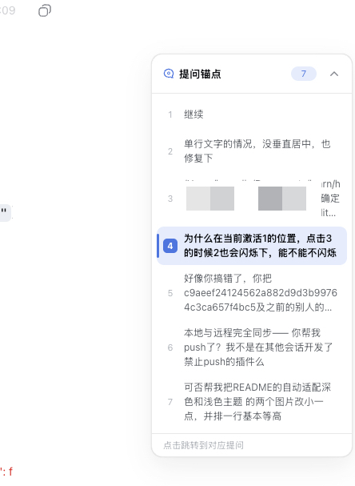
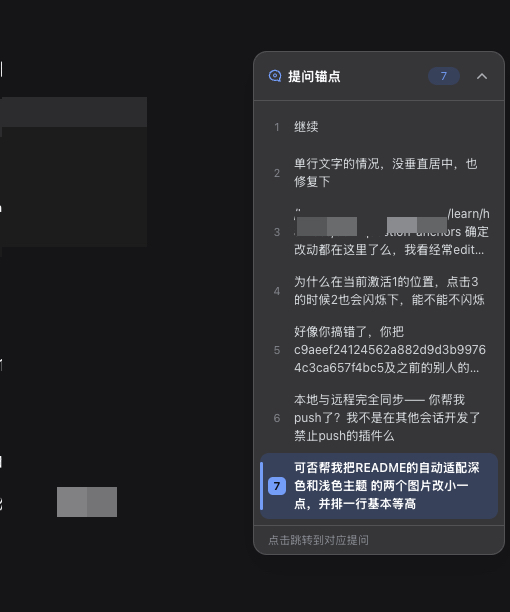

# @dsh-client/ui-question-anchors

DeepSeek Harness Web 客户端插件，为当前会话提供右侧「提问锚点」面板，帮助用户快速浏览和定位历史提问。

插件会收集会话中的用户消息（`user` 和 `steering`），并将其展示为可点击的锚点。点击锚点后，聊天区会平滑滚动到对应消息并短暂高亮；滚动聊天内容时，面板也会自动标记当前阅读位置。

## 功能

- 展示提问序号和文字预览，单条最多显示 3 行
- 点击锚点后平滑滚动到对应消息并短暂高亮
- 根据聊天区滚动位置自动切换当前锚点
- 支持收起为带提问数量徽标的悬浮按钮
- 无会话或无提问时自动隐藏
- 右侧详情面板打开时自动调整位置，避免重叠
- 支持中英文，并跟随 DSH 界面语言
- 自动适配深色和浅色主题

| 亮色主题 | 暗色主题 |
| :---: | :---: |
|  |  |

## 安装

在项目目录执行：

```sh
./scripts/install.sh
```

安装脚本会：

1. 在 Web profile 的 `node_modules` 中创建指向当前项目的软链接。
2. 将插件配置写入 Web profile 的 `cordis.patch.yml`。

默认 Web profile 位于 `~/.dsh/profiles/web`。如需使用其他 profile，可在执行脚本前设置 `DSH_PROFILE_DIR`。

安装完成后，重启 DSH Web 服务并刷新页面。插件集合发生变化时必须重启服务，仅修改现有客户端代码时可继续使用热更新。

## 卸载

1. 从 Web profile 的 `cordis.patch.yml` 中删除 `ui-question-anchors` 对应配置。
2. 删除 `node_modules/@dsh-client/ui-question-anchors` 软链接。
3. 重启 DSH Web 服务并刷新页面。

## 实现方式

该插件是纯浏览器客户端插件，不修改 DSH 源码：

- 通过 `dsh.client` 声明注册到 DSH 客户端模块系统
- 使用布局提供的 `shell.overlay` 插槽渲染浮动面板
- 订阅当前会话的 `ObservableSnapshot<ConversationSnapshot>` 获取消息变化
- 根据 `snapshot.chat.order` 和 `chat.nodes` 提取用户提问
- 通过 `[data-chat-anchor-key]` 定位消息，通过 `[data-conversation-scroll]` 监听滚动容器
- 使用 DSH 设计令牌适配主题和界面样式

客户端入口采用 `window.__ModuleLoader__.load(...)` 格式，仅依赖平台提供的 React 运行时，无需额外构建。

## 项目结构

```text
dsh-question-anchors/
├── lib/
│   ├── index.js       # Host 端入口
│   └── client.js      # 浏览器插件
├── scripts/
│   └── install.sh     # 本地安装脚本
├── package.json       # 插件声明与依赖配置
└── README.md
```

## 已知限制

- 添加或移除插件后需要重启 DSH Web 服务。
- 轨迹视图（trajectory tab）不会渲染聊天消息，锚点在该视图下无法定位目标。
- 面板宽度为 252px，在较窄窗口中可能遮挡聊天内容，可将其收起。
